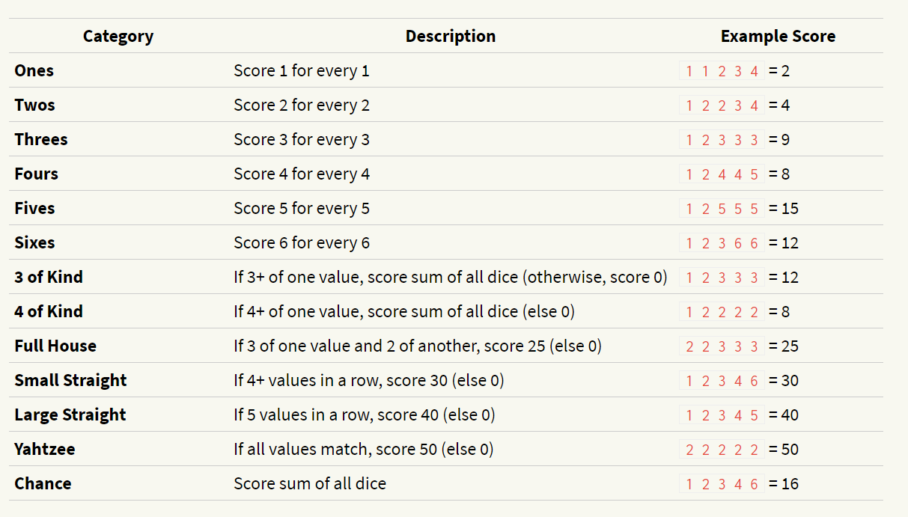

# YAHTZEE

This is one of the major projects of the course 'The Modern React Bootcamp (Hooks, Context, NextJS, Router)' on Udemy by Colt Steele.

## The Game
Yahtzee is a chance-and-strategy dice rolling game. A game is played over 13 rounds.

Each round, the player rolls five 6-sided dice. They may click on any number of dice to “freeze” or “unfreeze” them (frozen dice are displayed in a different color). They may re-roll the unfrozen dice up to 2 times.

Each round, they must assign their dice to any unclaimed scoring category. Each category scores differently.

After 13 rounds, the game is over, and the player’s score is the total of each scoring category.

### Scoring Categories



### Example Round
The initial roll is: 2 4 3 2 5.

The player decides to try to get as many twos as possible, and clicks to freeze both twos, then re-rolls, getting a new 2 3 5. They now have: 2 2 3 2 5.

The player decides to try for a full house, and freezes all of their twos and their three (hoping to roll another 3 to get a full house). They re-roll the die showing five, getting a 6 and now have 2 2 3 2 6.

Sadly, they didn’t get their full house. They could score this as:

- Twos: for 6 points
- Threes for 3 points
- Sixes: for 6 points
- Three of Kind: (twos) for 15 points
- Chance: for 15 points

Any other category they claimed on this round would score 0.

## How to Run

1. Clone this repo.
2. Run the following commands

```
npm install
npm start
```

Some starter code was given for this project. You can compare final code with the starter code by clicking [here.](https://github.com/singhsidak54/yahtzee/compare/starter-code...main)